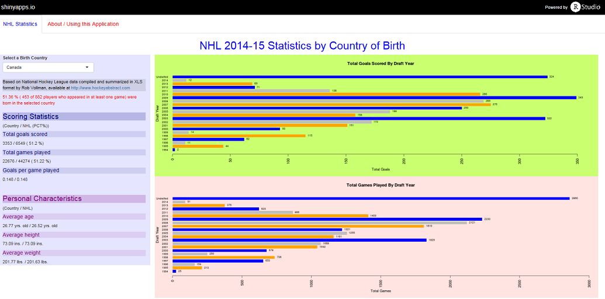

--- 
title       : Exploring NHL 2014-15 Statistics
subtitle    : Using Player's Country of Birth
author      : gr1llman
job         : 
framework   : io2012        # {io2012, html5slides, shower, dzslides, ...}
highlighter : highlight.js  # {highlight.js, prettify, highlight}
hitheme     : tomorrow      # 
url:
        lib: ../../libraries
        assets: ../../assests
widgets     : [mathjax]            # {mathjax, quiz, bootstrap}
mode        : selfcontained # {standalone, draft}
knit        : slidify::knit2slides

--- .class1 #id1 font-size: 50%;

## Overview

### Purpose

The [NHL Statistics by Country of Birth application] (https://gr1llman.shinyapps.io/DevelopingDataProducts) is intended to provide the user with the ability to generate statistical summaries, as well as visualizations, from NHL 2014-15 data based on the birth country of players who played at least one game during that season.

### Background

The application has been developed by github user gr1llman to satisfy project requirements for "Developing Data Products" - a course offered by Johns Hopkins Bloomberg School of Public Health through [coursera.org] (http://www.coursera.org)


### Disclaimer

The application and the developer are in no way affiliated with the NHL, nor to Rob Vollman, who compiled the data used by the application, which is available at [hockeyabstract.com] (http://www.hockeyabstract.com)


--- .class #id

## Using the Application

The application is hosted online at [https://gr1llman.shinyapps.io/DevelopingDataProducts] (https://gr1llman.shinyapps.io/DevelopingDataProducts)

There are two (2) tabs
- "NHL Statistics" with the interactive part of the application
- "About / Using this Application" with background and instructions.

The interface is simple.  The user selects a country of birth from a dropdown menu which triggers an update of the statistics as well as two (2) bar charts.

One bar charts provides a visualization of the total number of goals scored by players born in the selected country, further aggregated by draft year.  The other provides a similar view of the total number of games played.

Statistics are in the left hand panel of the application and include goal scoring statistics, compared to the entire NHL, as well as the average height, weight and age of the players.

--- .class #id 

## Sample Visualization - Players Born in Canada



--- .class #id 

## Recommended Enhancements

```{r read_nhl, echo=FALSE}
#
# This code chunk reads the data to facitate using it inline in the slides
#
# Read the data
nhl <- read.csv('NHL2014-15.csv')
vars <- dim(nhl)[2]
players <- dim(nhl)[1]
```
There is a very large amount of data available about the NHL.  Just the basic data used for this application has `r vars` variables about the `r players` players who played in 2014-15.

Enhancements could include providing the ability to select the variables to summarize and providing support for additional statistical functions, such as regression.

Additional visualization could also provide insight.  Here is an example of one comparing goals scored to the age of the goal scorer.  Visualizations like this should be incorporated in a future release.

```{r figure_1,  fig.width=13, fig.height=4, echo=FALSE}
#
# This code chunk reads the data and generates a barplot of all goals scored by age of player
#
# Read the data
nhl <- read.csv('NHL2014-15.csv')
# Aggregate by age
aggnhl <- tapply(nhl$G, nhl$Age, sum)
# Produce the plot
par(bg = "snow1")
bp <- barplot(aggnhl, horiz = TRUE,
  xlim = range(0,700),
  col=c("blue","orange","tan"),
  cex.names=0.7, las=2, border = NA,
  main="NHL 2014-15 Goals Scored By Age of Player",
  xlab="Total Goals",
  ylab="Age")
text(as.vector(aggnhl), bp, as.vector(aggnhl),
       cex=0.7, pos=4)          
```


